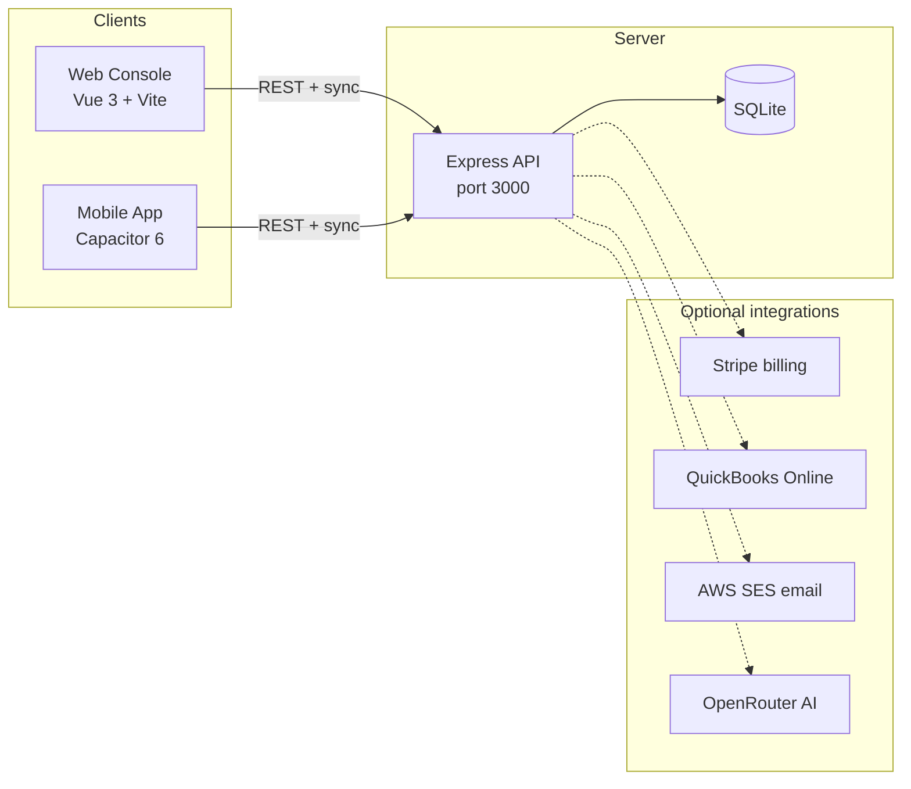

# BrewLedger Architecture

High-level overview of the open-source BrewLedger stack.

- [docs/getting-started.md](docs/getting-started.md) — Local setup and first login
- [docs/deployment.md](docs/deployment.md) — Production checklist
- [docs/SYSTEMS-AND-IMPLEMENTATION-DIAGRAM.md](docs/SYSTEMS-AND-IMPLEMENTATION-DIAGRAM.md) — Detailed Mermaid diagrams

## Components

## Repository layout

| Path | Role |
|------|------|
| `server/` | Express backend, SQLite, auth, sync API, TTB helpers |
| `platforms/console/` | Desktop web SPA (inventory, batches, reports, settings) |
| `platforms/brewledger-app/` | Capacitor mobile app (offline-first IndexedDB + sync) |
| `docs/` | Architecture diagrams |

## Data model (core)

- **Immutable ledger** — append-only `ledger_entries`; corrections via reversal entries.
- **On-hand cache** — derived from ledger for fast inventory queries.
- **Batches** — recipes, milestones, vessels, packaging runs tied to production.
- **Organizations** — multi-user, org-scoped data; JWT-like session tokens.

## Sync

Mobile and console clients use IndexedDB (Dexie) locally. `SyncService` pushes local changes and pulls server updates over `/api/sync` endpoints. Conflict handling favors server authority with client retry.

## Auth

Register/login → session token stored client-side → `Authorization: Bearer` on API requests. Optional `MASTER_PASSWORD` env for admin testing only (leave unset in production).

## TTB

Console `TTBFormService` aggregates ledger and batch data into Form 5130.9 field mappings. PDF export via `pdf-lib`. Not legal advice — operator responsible for filings.

## Deployment notes

- Default local: HTTP on port 3000, console on 5174. See [docs/getting-started.md](docs/getting-started.md).
- Production: set `TLS_KEY_PATH` / `TLS_CERT_PATH`, build console (`npm run build`), point `STATIC_DIR` at `platforms/console/dist`. See [docs/deployment.md](docs/deployment.md).
- Blog subsystem removed from OSS release — no `/blog` routes.

## Removed from OSS release

- Editorial blog ("The Ledger") and `blogrip/` demo
- Internal `changes/` analysis docs
- Production secrets (`.env` only, never committed)
