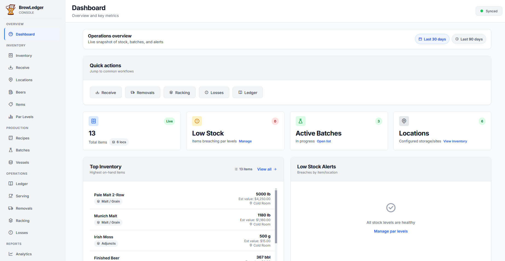
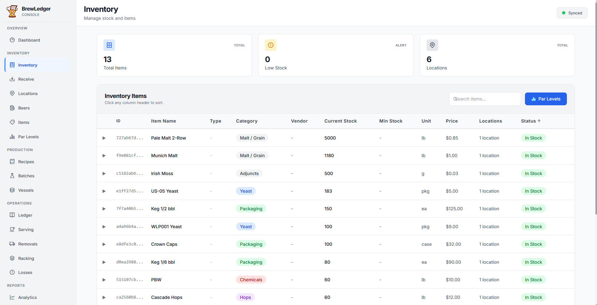
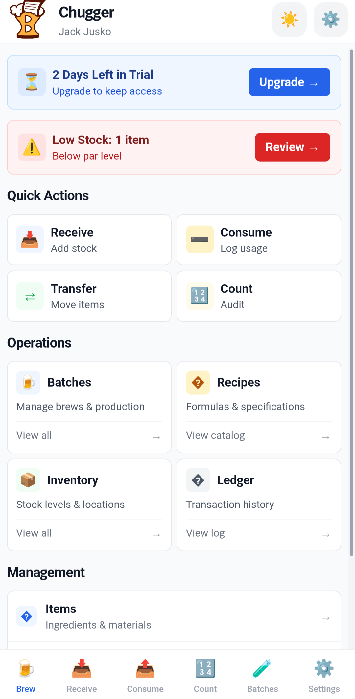

<p align="center">
  
</p>

<p align="center">
  <strong>Open-source brewery operations platform</strong><br/>
  Inventory · Production · Compliance · Taproom — self-hosted on your hardware
</p>

<p align="center">
  <a href="https://github.com/jackjusko/brewledger-oss/blob/main/LICENSE"></a>
  <a href="https://nodejs.org/">= 18" /></a>
  <a href="https://vuejs.org/"></a>
  <a href="https://github.com/jackjusko/brewledger-oss/actions/workflows/ci.yml"></a>
</p>

<p align="center">
  <a href="docs/getting-started.md">Quick start</a> ·
  <a href="ARCHITECTURE.md">Architecture</a> ·
  <a href="docs/contributing.md">Contributing</a> ·
  <a href="FAQ.md">FAQ</a>
</p>

# BrewLedger

Open-source brewery operations platform for inventory, production, compliance, and taproom workflows. BrewLedger is licensed under GPLv3 and self-hosted—you run the API server and web console on your own hardware.

Brewery operators use BrewLedger to track what they have, what they brewed, and what they served or removed. Developers can clone the repo, run it locally, fork it, or contribute fixes and improvements.

**Why open source?** BrewLedger was built as a full brewery operations product. Open-sourcing it makes the code a portfolio piece, a reference for other builders, and a starting point for anyone who wants to self-host brewery management software. Bug fixes, docs improvements, and security hardening are especially welcome.

## Screenshots

| Desktop console | Desktop console | Mobile app |
|:---:|:---:|:---:|
|  |  |  |

## What's included

| Component | Path | Description |
|-----------|------|-------------|
| API server | `server/` | Express + SQLite backend (auth, sync, ledger, batches, TTB helpers) |
| Web console | `platforms/console/` | Vue 3 desktop web app for day-to-day brewery management |
| Mobile app | `platforms/brewledger-app/` | Capacitor 6 source for iOS and Android (you build and sign binaries) |

## Features

- **Inventory ledger** — Receive, consume, transfer, and count stock with an append-only transaction history
- **Batch tracking** — Recipes, vessels, readings, milestones, and production-complete workflows
- **TTB Form 5130.9** — Tools to aggregate operational data into form field mappings (not legal advice—see [FAQ](FAQ.md))
- **Serving & taproom** — Tank occupancy, volume tracking, and removal workflows
- **Multi-device sync** — Offline-first clients (IndexedDB) sync with the server when online
- **Optional integrations** — Stripe billing, QuickBooks Online, AWS SES email, OpenRouter AI assistant (all degrade gracefully when unset)

## Stack at a glance

| Layer | Technology |
|-------|------------|
| API server | Node.js, Express 5, SQLite |
| Web console | Vue 3, Vite, Tailwind CSS, Dexie (IndexedDB) |
| Mobile app | Vue 3, Capacitor 6, Dexie (IndexedDB) |
| Auth | Token-based sessions with bcrypt password hashing |

See [ARCHITECTURE.md](ARCHITECTURE.md) for a system overview.

## Quick start

**Prerequisites:** Node.js 18+ and npm.

1. **Clone and configure**

   ```bash
   git clone https://github.com/jackjusko/brewledger-oss.git
   cd brewledger-oss
   cp .env.example .env
   ```

   Defaults work for local HTTP on port 3000. See [docs/getting-started.md](docs/getting-started.md) for details.

2. **Install dependencies**

   ```bash
   cd server && npm install && cd ..
   cd platforms/console && npm install && cd ../..
   ```

3. **Initialize the database**

   ```bash
   cd server
   node init_db.js
   ```

4. **Start the API server**

   ```bash
   cd server
   npm start
   ```

   Server runs at `http://localhost:3000`.

5. **Start the web console** (second terminal)

   ```bash
   cd platforms/console
   npm run dev
   ```

   Console runs at `http://localhost:5174`. Register an organization, then log in.

For first-login navigation, troubleshooting, and optional mobile setup, see [docs/getting-started.md](docs/getting-started.md).

## Documentation

| Document | Description |
|----------|-------------|
| [docs/getting-started.md](docs/getting-started.md) | Full local setup and first-login tour |
| [docs/deployment.md](docs/deployment.md) | Production checklist (TLS, static build, env vars) |
| [docs/contributing.md](docs/contributing.md) | How to contribute, run tests, submit PRs |
| [docs/README.md](docs/README.md) | Documentation index |
| [FAQ.md](FAQ.md) | Common questions about scope, integrations, and licensing |
| [ARCHITECTURE.md](ARCHITECTURE.md) | High-level system design |
| [SECURITY.md](SECURITY.md) | How to report security issues |

## Optional integrations

Stripe billing, QuickBooks Online, AWS SES email, and the OpenRouter AI assistant are optional. When environment variables are missing, those features return "not configured"—core brewery operations still work.

See [.env.example](.env.example) for all variables.

## Contributing

Pull requests are welcome—especially bug fixes, documentation improvements, and security hardening. See [docs/contributing.md](docs/contributing.md) for setup, test commands, and PR expectations. Use the issue templates when reporting bugs or proposing features.

## License

GNU General Public License v3.0 — see [LICENSE](LICENSE).

---

*Hosted BrewLedger is also available at [getbrewledger.com](https://getbrewledger.com). This repository is the self-hosted open-source edition.*
